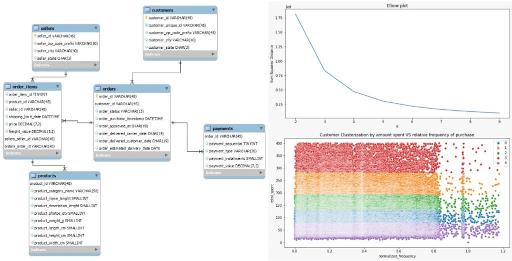
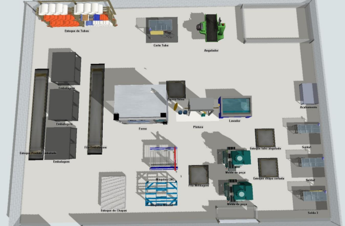

# Portfolio

---

## Predicting House Prices with Random Forest & XGBoost 

### **Skills:** Python, Random Forest, XGBoost
 

 With detailed EDA and Feature Engineering, this model was trained to accuretly predict Houses Sale Price, using three Regression methods: Random Forests, Extreme Gradient Boosting, and a compound of both. The resulting model performed accurately on testing phase. 

<figure>  
 

</figure>
 
---  
## Customer Clustering using K means
  
### **Skills:** SQL, mySQL, Python, KMeans

 This project was develop to dynamically clusterize customers to an E-commerce database, based on Frequency and Amount of Money Spent, to better tailor marketing resource allocation. It was used KMeans to define the customers importance, and mySQL to create and maintin (UPDATE) the database. 

<figure>
 

</figure>
 
---
## Brest Cancer Classification with PCA & SVM
  
### **Skills:** SVM, PCA

 This Machine Learning model was build with the objective to better predict if a Brest Cancer is either Benign or Malignant. To train and test the model, it was used the 'Breast Cancer Wisconsin Database', and built with PCA decomposition and the SVM classifier -predict Cancer class (1: Malignant | 0: Benign). 

<figure>
 

</figure>
 
---
## College Article: Optimization model using Descrete Event Simulation
  
### **Skills:** Statistics, Operations Research

 Research paper published during college graduation, together with some fellow students. Project helped decision making and enhanced company results, being an essential factor for their success. The computational simulation is founded as an auxiliary and complementary tool to the decision. 
  

<figure>
 

</figure>
 

Page template from <a href="https://github.com/evanca/quick-portfolio">evanca</a>

<!-- Remove above link if you don't want to attibute -->
